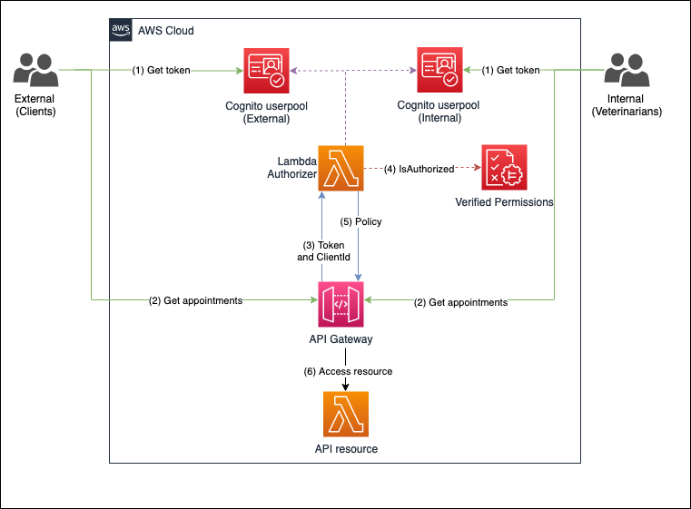

# Unify Identity Providers with Amazon Verified Permissions and an Amazon API Gateway Lambda authorizer

In many cases, enterprises need to build a unified access control layer to their APIs that allow access from multiple sources (for example multiple identity providers or different user groups and categories). One common use case would be an API exposed to different tenants through API Gateway, which can be supported by an Amazon Cognito multi-tenancy solution. For example, two Amazon Cognito User-pools could be created for an application, one for patients and another for healthcare providers with a common API that is used to provide access.

In addition to Amazon Cognito, developers can use Amazon API Gateway to manage, and expose APIs to provide access to back end resources. API Gateway is a fully managed service that allows developers to build APIs that acts as an entry point for applications and allows access to data, or functionality running on EC2, ECS, Lambda or any web application. To integrate with multiple IDPs, an AWS Lambda authorizer is used to control access to the API with Amazon Cognito as an identity provider. The Lambda authorizer enables customization of API authorization, and in this case allows multiple IDPs to be leveraged.

[Amazon Verified Permissions](https://aws.amazon.com/verified-permissions/)is a standalone service used to implement fine-grained authorization on resources in an application. Amazon Cognito is used to provide the authentication function for users prior to being authorized by Amazon Verified Permissions. All four services are leveraged together to combine multi IDPs into a centralized application access solution. The solution isn't limited to the Amazon Cognito IDP, any third party identity provider that generates JWTs can be used.

## Solution Overview

In this blog, we describe an architectural design that showcases how to use multiple Amazon Cognito User Pools, Amazon Verified Permissions, and a Lambda authorizer for API Gateway backed APIs. The solution is based on user-pool multi-tenancy for user authentication. It leverages Amazon Cognito user pools to assign authenticated users a set of temporary and least privilege credentials for application access. Once users are authenticated, they are authorized to access APIs through a lambda function. This function interfaces with Amazon Verified Permissions to apply the appropriate access policy based on user attributes.

### Architecture reference (Request Flow):

The following figure shows the basic architecture and information flow for user requests.



**Figure 1 – User request flow**

Let’s go through the request flow to understand what happens at each step, as shown in Figure 1:

1. There two groups of users – external (Clients) and Internal (Veterinarians).
   These user groups authenticate against an IDP (Cognito in this case).
2. The groups attempt to access an API through API gateway along with their JWT token and client ID.
3. The Lambda authorizer will validate the claims. 
   **Note:** If Amazon Cognito is the IDP then IsAuthorizedWithToken can be used to simplify the step.
4. Once the token is validated, the Lambda Authorizer will make a query to Amazon Verified Permissions with associated policy information to check the request.
5. Based on the group info API Gateway will evaluate the policy to the appropriate API Resource.

`Note`: To further optimize Lambda authorizer, the authorization decision can be cached or disabled, depending on your needs. By enabling cache, you could improve the performance as the authorization policy will be returned from the cache whenever there is a cache key match. To learn more, see [Configure a Lambda authorizer using the API Gateway console](https://docs.aws.amazon.com/apigateway/latest/developerguide/configure-api-gateway-lambda-authorization-with-console.html).

## Getting Started

### Prerequisites

For this solution, you need the following prerequisites:

* The [AWS Command Line Interface (CLI)](https://aws.amazon.com/cli/) installed and [configured for use](https://docs.aws.amazon.com/cli/latest/userguide/cli-chap-configure.html).
* Python 3.9 or later, to package Python code for Lambda
   `Note`: We recommend that you use a [virtual environment](https://docs.python.org/3.9/library/venv.html) or [virtualenvwrapper](https://virtualenvwrapper.readthedocs.io/en/latest/) to isolate the solution from the rest of your Python environment.
* An IAM role or user with enough permissions to create Amazon Cognito User Pool, IAM Role, Lambda, IAM Policy, and API Gateway.
* jq for JSON processing in bash script.
   Install on Ubuntu/Debian:

   ```bash
   sudo apt-get install jq
   ```

   Install on Mac with Homebrew:

   ```bash
   brew install jq
   ```

* The GitHub repository for the solution. You can [download it](https://github.com/aws-samples/amazon-cognito-avp-apigateway/archive/refs/heads/main.zip), or you can use the following [Git](https://git-scm.com/) command to download it from your terminal.  
    `Note`: This sample code should be used to test out the solution and is not intended to be used in production account.

   ```bash
   $ git clone https://github.com/aws-samples/amazon-cognito-avp-apigateway.git
   $ cd amazon-cognito-avp-apigateway
   ```

To implement this reference architecture, you will be utilizing the  following services:

* [Amazon Verified Permissions](https://aws.amazon.com/verified-permissions/) is a new service that helps you implement and enforce fine-grained authorization on resources within the applications that you build and deploy, such as HR systems and banking applications.
* [Amazon API Gateway](https://aws.amazon.com/api-gateway/) is a fully managed service that makes it easy for developers to create, publish, maintain, monitor, and secure APIs at any scale. APIs act as the "front door" for applications to access data, business logic, or functionality from your backend services. Using API Gateway, you can create RESTful APIs and WebSocket APIs that enable real-time two-way communication applications. API Gateway supports containerized and serverless workloads, as well as web applications.
* [AWS Lambda](https://aws.amazon.com/lambda/) is a serverless compute service that lets you run code without provisioning or managing servers, creating workload-aware cluster scaling logic, maintaining event integrations, or managing runtimes. With Lambda, you can run code for virtually any type of application or backend service - all with zero administration
* [Amazon Cognito](https://aws.amazon.com/cognito/) provides an identity store that scales to millions of users, supports social and enterprise identity federation, and offers advanced security features to protect your consumers and business. Built on open identity standards, Amazon Cognito supports various compliance regulations and integrates with frontend and backend development resources.


`Note`: This solution was tested in the us-east-1 region. Before selecting a region, verify that the necessary [services—Amazon Verified Permissions, Amazon Cognito, API Gateway, and Lambda—are available in those Regions](https://aws.amazon.com/about-aws/global-infrastructure/regional-product-services/).

### Deploy the sample solution

From within the directory where you downloaded the sample code from GitHub, first run the following command to package the lambda functions. Then run the next command to generate a random Amazon Cognito user password and create the resources described in the previous section.

`Note`: In this case you are generating a random user password for demo purposes. Follow best practices for user passwords in production implementations.

```bash
$ bash ./helper.sh package-lambda-functions
 …
Successfully completed packaging files.
```

```bash
$ bash ./helper.sh cf-create-stack-gen-password
 …
Successfully created CloudFormation stack.
```

#### Validate Amazon Cognito user creation

To validate that an Amazon Cognito user has been created successfully, run the following command to open the Amazon Cognito UI in your browser and then log in with your credentials. 

`Note`: When you run this command, it returns the user name and password that you should use to log in.

For Internal User Pool Domain Users

```bash
$ bash ./helper.sh open-cognito-internal-domain-ui
 Opening Cognito UI...
 URL: xxxxxxxxx
 Please use following credentials to login:
 Username: cognitouser
 Password: xxxxxxxx
```

For External User Pool Domain Users

```bash
$ bash ./helper.sh open-cognito-external-domain-ui
 Opening Cognito UI...
 URL: xxxxxxxxx
 Please use following credentials to login:
 Username: cognitouser
 Password: xxxxxxxx
```

#### Validate Amazon Cognito JWT upon login

Since we haven’t installed a web application that would respond to the redirect request, Amazon Cognito will redirect to localhost, which might look like an error. The key aspect is that after a successful log in, there is a URL similar to the following in the navigation bar of your browser:

```bash
http://localhost/#id_token=eyJraWQiOiJicVhMYWFlaTl4aUhzTnY3W...
```

### Test the API configuration

Before you protect the API with Amazon Cognito so that only authorized users can access it, let’s verify that the configuration is correct and the API is served by API Gateway. The following command makes a curl request to API Gateway to retrieve data from the API service.

```bash
$ bash ./helper.sh curl-api
API to check his appointment details of PI-T123
URL: https://epgst74zff.execute-api.us-east-1.amazonaws.com/dev/appointment/PI-T123
Response: 
{"appointment": {"id": "PI-T123", "name": "Dave", "Pet": "Onyx - Dog. 2y 3m", "Phone Number": "+1234567", "Visit History": "Patient History from last visit with primary vet", "Assigned Veterinarian": "Jane"}}

API to check his appointment details of PI-T124
URL: https://epgst74zff.execute-api.us-east-1.amazonaws.com/dev/appointment/PI-T124
Response: 
{"appointment": {"id": "PI-T124", "name": "Joy", "Pet": "Jelly - Dog. 6y 2m", "Phone Number": "+1368728", "Visit History": "None", "Assigned Veterinarian": "Jane"}}

API to check his appointment details of PI-T125
URL: https://epgst74zff.execute-api.us-east-1.amazonaws.com/dev/appointment/PI-T125
Response: 
{"appointment": {"id": "PI-T125", "name": "Dave", "Pet": "Sassy - Cat. 1y", "Phone Number": "+1398777", "Visit History": "Patient History from last visit with primary vet", "Assigned Veterinarian": "Adam"}}
```

### Protect the API

To protect your API, the following is required:

1. Amazon Verified Permissions to store the policy for user authorization.
2. A Lambda function to verify the user’s access token and authorize the user via Amazon Verified Permissions.

#### Update and create resources

Run the following command to update existing resources and create a Lambda authorizer and Amazon Verified Permissions policy store.

```bash
$ bash ./helper.sh cf-update-stack
 Successfully updated CloudFormation stack.
```

### Test the custom authorizer setup

Begin your testing with the following request, which doesn’t include an access token.

`Note`: Wait for a few minutes to allow API Gateway to deploy prior to running the commands below.

```bash
$ bash ./helper.sh curl-api
API to check his appointment details of PI-T123
URL: https://epgst74zff.execute-api.us-east-1.amazonaws.com/dev/appointment/PI-T123
Response: 
{"message":"Unauthorized"}

API to check his appointment details of PI-T124
URL: https://epgst74zff.execute-api.us-east-1.amazonaws.com/dev/appointment/PI-T124
Response: 
{"message":"Unauthorized"}

API to check his appointment details of PI-T125
URL: https://epgst74zff.execute-api.us-east-1.amazonaws.com/dev/appointment/PI-T125
Response: 
{"message":"Unauthorized"}
```

The request is denied with the message **Unauthorized**. At this point, the Amazon API Gateway expects a header named Authorization (case sensitive) in the request. If there’s no authorization header, the request is denied before it reaches the lambda authorizer. This is a way to filter out requests that don’t include required information.

Use the following command for the next test. In this test, you pass the required header but the token is invalid because it wasn’t issued by Amazon Cognito but is a simple JWT-format token stored in ./helper.sh. To learn more about how to decode and validate a JWT, see [decode and verify an Amazon Cognito JSON token](https://aws.amazon.com/premiumsupport/knowledge-center/decode-verify-cognito-json-token/).

```bash
$ bash ./helper.sh curl-api-invalid-token
 {"Message":"User is not authorized to access this resource"}
```

This time the message is different. The Lambda authorizer received the request and identified the token as invalid and responded with the message **User is not authorized to access this resource**.

To make a successful request to the protected API, your code will need to perform the following steps:

1. Use a user name and password to authenticate against your Amazon Cognito user pool.
2. Acquire the tokens (id token, access token, and refresh token).
3. Make an HTTPS (TLS) request to API Gateway and pass the access token in the headers.

Finally, let’s programmatically log in to Amazon Cognito UI, acquire a valid access token, and make a request to API Gateway. Run the following command to call the protected API.

```bash
$ ./helper.sh curl-protected-internal-user-api

Getting API URL, Cognito Usernames, Cognito Users Password and Cognito ClientId...
User: Jane
Password: Pa%%word-2023-04-17-17-11-32
Resource: PI-T123
URL: https://16qyz501mg.execute-api.us-east-1.amazonaws.com/dev/appointment/PI-T123

Authenticating to get access_token...
Access Token: eyJraWQiOiJIaVRvckxxxxxxxxxx6BfCBKASA

Response: 
{"appointment": {"id": "PI-T123", "name": "Dave", "Pet": "Onyx - Dog. 2y 3m", "Phone Number": "+1234567", "Visit History": "Patient History from last visit with primary vet", "Assigned Veterinarian": "Jane"}}

User: Adam
Password: Pa%%word-2023-04-17-17-11-32
Resource: PI-T123
URL: https://16qyz501mg.execute-api.us-east-1.amazonaws.com/dev/appointment/PI-T123

Authenticating to get access_token...
Access Token: eyJraWQiOiJIaVRvckxxxxxxxxxx6BfCBKASA

Response: 
{"Message":"User is not authorized to access this resource"}

User: Adam
Password: Pa%%word-2023-04-17-17-11-32
Resource: PI-T125
URL: https://16qyz501mg.execute-api.us-east-1.amazonaws.com/dev/appointment/PI-T125

Authenticating to get access_token...
Access Token: eyJraWQiOiJIaVRvckxxxxxxxxxx6BfCBKASA

Response: 
{"appointment": {"id": "PI-T125", "name": "Dave", "Pet": "Sassy - Cat. 1y", "Phone Number": "+1398777", "Visit History": "Patient History from last visit with primary vet", "Assigned Veterinarian": "Adam"}}
```

```bash
$ ./helper.sh curl-protected-external-user-api

Now calling external userpool users for accessing request
User: Dave
Password: Pa%%word-2023-04-17-17-11-32
Resource: PI-T123
URL: https://16qyz501mg.execute-api.us-east-1.amazonaws.com/dev/appointment/PI-T123

Authenticating to get access_token...
Access Token: eyJraWQiOiJIaVRvckxxxxxxxxxx6BfCBKASA

Response: 
{"appointment": {"id": "PI-T123", "name": "Dave", "Pet": "Onyx - Dog. 2y 3m", "Phone Number": "+1234567", "Visit History": "Patient History from last visit with primary vet", "Assigned Veterinarian": "Jane"}}

User: Joy
Password Pa%%word-2023-04-17-17-11-32
Resource: PI-T123
URL: https://16qyz501mg.execute-api.us-east-1.amazonaws.com/dev/appointment/PI-T123

Authenticating to get access_token...
Access Token: eyJraWQiOiJIaVRvckxxxxxxxxxx6BfCBKASA

Response: 
{"Message":"User is not authorized to access this resource"}

User: Joy
Password Pa%%word-2023-04-17-17-11-32
Resource: PI-T124
URL: https://16qyz501mg.execute-api.us-east-1.amazonaws.com/dev/appointment/PI-T124

Authenticating to get access_token...
Access Token: eyJraWQiOiJIaVRvckxxxxxxxxxx6BfCBKASA

Response: 
{"appointment": {"id": "PI-T124", "name": "Joy", "Pet": "Jelly - Dog. 6y 2m", "Phone Number": "+1368728", "Visit History": "None", "Assigned Veterinarian": "Jane"}}
```

This time, you receive a response with data from the API service. Let’s examine the steps that the example code performed:

1. Lambda authorizer validates the access token.
2. Lambda authorizer leverages Amazon Verified Permissions to evaluate the user's requested actions against the policy store.
3. Lambda authorizer passes the IAM policy back to API Gateway.
4. API Gateway evaluates the IAM policy and the final effect is an allow.
5. API Gateway forwards the request to Lambda.
6. Lambda returns the response.

In each of the tests, internal and external, a request was denied because the user was not authorized. This is due to the Amazon Verified Permissions policies. In the internal user pool, Veterinarians are only allowed to see their own patients data. Similarly, in the external user pool, clients are only allowed to see their own data. See the policies statements below.

Internal Policy
```
permit (principal in UserGroup::"AllVeterinarians",
   action == Action::"GET/appointment",
   resource in UserGroup::"AllVeterinarians")
   when { principal == resource.Veterinarian };
```

External Policy
```
permit (principal in UserGroup::"AllClients",
   action == Action::"GET/appointment",
   resource in UserGroup::"AllClients")
   when { principal == resource.owner};
```

Run the following command to delete the deployed resources and clean up.

```bash
$ bash ./helper.sh cf-delete-stack
```

### Next Steps

In this blog we demonstrated how multiple Amazon Cognito User Pools can be leveraged alongside Amazon Verified Permissions to build a single access layer to APIs. Amazon Cognito was used in this example, but another third party IDP could be leveraged. As a next step, explore the [Cedar playground](https://www.cedarpolicy.com/en) to test policies that can be used with Amazon Verified Permissions, or expand this solution by integrating a third party IDP.

Please validate that this solution meets your company's security requirements prior to use.

---

## Security

See [CONTRIBUTING](CONTRIBUTING.md#security-issue-notifications) for more information.

## License

This library is licensed under the MIT-0 License. See the LICENSE file.
